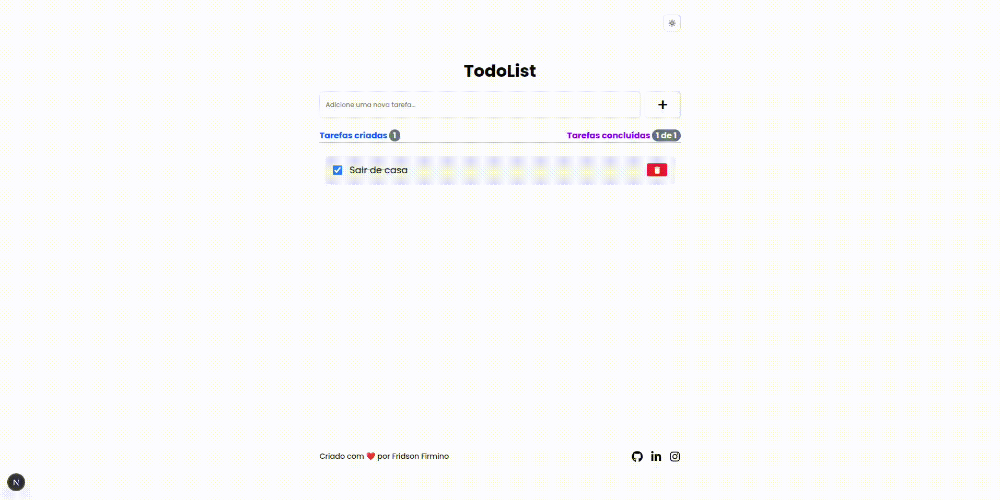
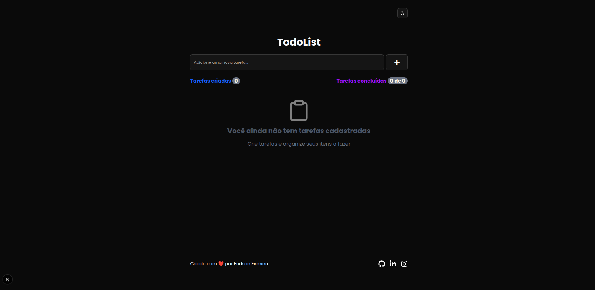
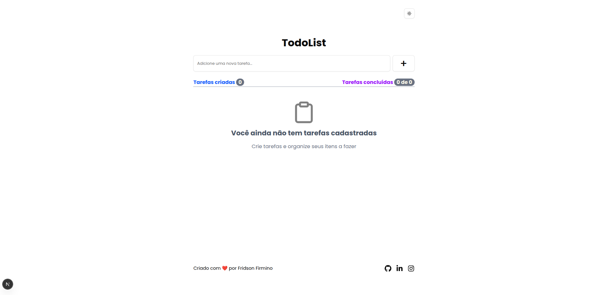
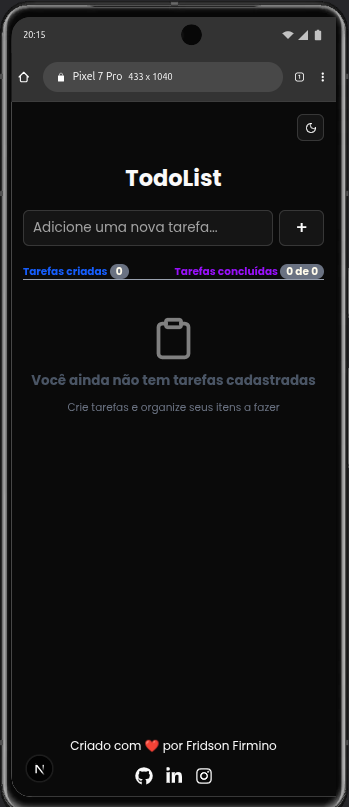
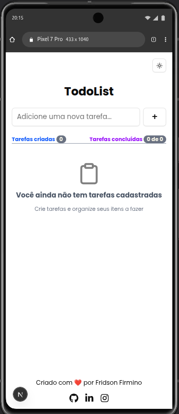

# Aplicativo web Todo list.

## 📌 Sobre

**Todo List Web** é um aplicativo web desenvolvido para gerenciamento de tarefas simples.  
Ideal para ser usado diretamente no navegador, o projeto permite ao usuário **adicionar**, **visualizar**, **marcar como concluída** e **remover tarefas** de maneira intuitiva.

## 🎥 Demonstração

<p align="center">
  
</p>

## ✨ Funcionalidades

- ✅ Temas **dark e light**
- ✍️ Inserir tarefas
  - Persistência no **LocalStorage**
  - Inserção com tecla **Enter**
  - Validação para evitar campo vazio
- 🔄 Alterar estado da tarefa
  - Marcar como **concluída**
  - **Apagar** tarefa
- 📱 Multiplataforma (**responsivo**)

## 🎨 Layout

### 💻 Desktop

<p align="center">
  
  
</p>

### 📱 Mobile

<p align="center">
  
  
</p>

## 🔨 Tecnologias utilizadas

- [Nextjs](https://nextjs.org/)
- [TaiwindCss](https://tailwindcss.com/)
- [LocalStorage](https://developer.mozilla.org/pt-BR/docs/Web/API/Window/localStorage)
- [Typescript](https://www.typescriptlang.org/)
- [Shadcn](https://v3.shadcn.com/)

## 🚀 Instalação e uso

```bash
  # Clone o repositório
    git clone https://github.com/FridsonFirmino/todo-list-web.git

  # Acesse a pasta do projeto
    cd todo-list-web

  # Instale as dependências
    npm install

  # Execute a aplicação
    npm run dev

    # O servidor inciará na porta:3000 - acesse http://localhost:3000
```
